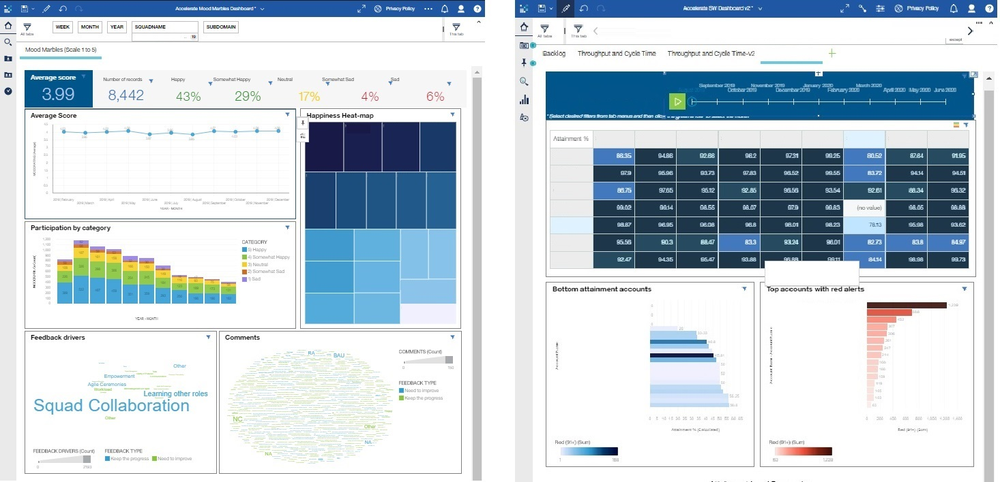
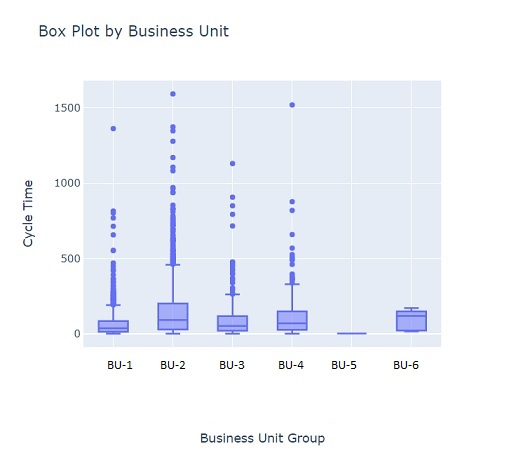

## [Project 1: Accelerate Dashboards in Cognos Analytics for the Asset Management Department]()
* Developed Dynamic dashboards in Cognos Analytics to conduct trend analysis on key Accelerate Metrics for squad members, iteration managers, squad leaders and global leaders. The solution included operations, client satisfaction (NPS) and employee satisfaction (Mood Marbles) metrics.
* Tools: Cognos Analytics to develop visualizations, Cognos Framework Manager for data package creation, Excel for manual uploads, IBM Forms for data capturing.
* Managed access and permissions for Cognos Analytics Analytics folder used for global business metrics within Asset Management via Blue Groups.

Employee Satisfaction Metrics (Mood Marbles), Attainment and compliance dashboards

Throughput, Cycle Time and Backlog metrics.

## [Project 2: Cycle Time Analysis by Business Unit]()
* Created an estatistical analysis on Cycle Time using Box Plot visualizations by Business Unit
* Raw data was extracted from Cognos reports and analyzed in Jupyter Notebooks
* Exploratory data analysis (descriptive statistics) and Box Plot visualizations were created using Python
* For dynamic results, Python library Plotly was used for data visualization
* Conclusion: Output visualization provided the upper limit Cycle Time by Business Unit, allowing the Sales Team to focus on reviewing those opportunities marked as outliers by the Box Plot visualization.

## [Project 3: Cognos Analytics dashborard for in campus initiative]()
* Developed a Cognos Analytics dashboard to obtain the NPS score from the  IBM Sales Dashboard Workshops provided by the local ISD initiative
* Tools: Watson Studio in IBM Cloud.

